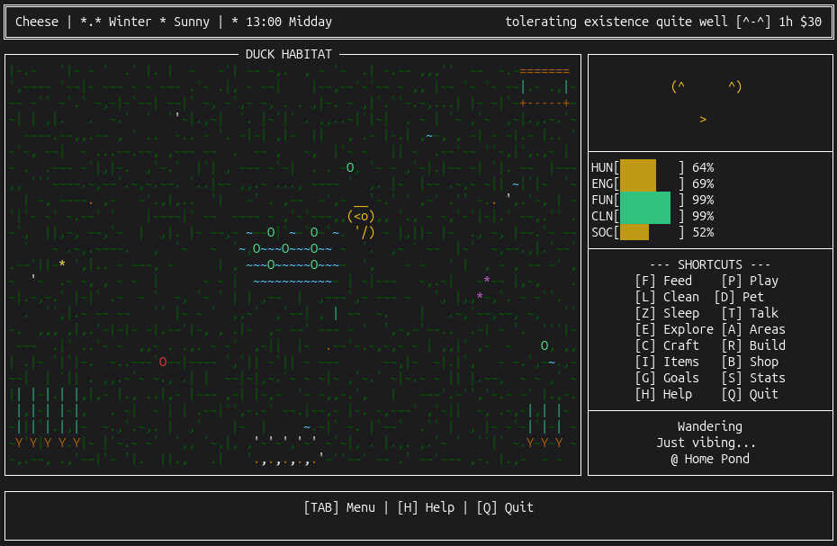

# Cheese the Duck
### A Terminal Virtual Pet Game




---

## About

**Cheese the Duck** is a feature-rich terminal-based virtual pet game where you raise and care for a duck with a personality all its own. Inspired by classic Tamagotchi pets, this game combines nostalgic pet-raising gameplay with modern features like AI-powered behavior, dynamic conversations, and a surprisingly deep world to explore.

Your duck isn't just a collection of stats—it has moods, personality traits, and autonomous behaviors that make each playthrough unique. The world around your duck is alive with changing weather, passing time, and... other things you'll discover as you play.

Some features are obvious. Others reveal themselves over time. Pay attention.

---

## Core Systems

### Care & Survival
Monitor five essential needs: **Hunger**, **Energy**, **Fun**, **Cleanliness**, and **Social**. Each need decays over time and affects your duck's mood. Neglect them too long and your duck becomes miserable. Keep them balanced and watch your companion thrive.

Color-coded progress bars show you at a glance what needs attention:
- **Green** (70%+): Doing great
- **Yellow** (40-69%): Getting low
- **Red** (below 40%): Critical

### Growth & Personality
Your duck grows through distinct life stages: Egg -> Duckling -> Teen -> Adult -> Elder. Each stage brings new behaviors and interactions.

Every duck has unique personality traits that shape how it behaves:
- Clever <-> Derpy
- Brave <-> Timid
- Active <-> Lazy
- Social <-> Shy
- Neat <-> Messy

These aren't just flavor text—they genuinely affect what your duck does when you're not directly commanding it.

### Autonomous AI Behavior
This isn't a passive pet that sits waiting for your input. Your duck has agency. It wanders, explores its habitat, interacts with items you've placed, and makes decisions based on its needs and personality.

Derpy ducks make questionable choices. Brave ducks take risks. Lazy ducks nap. A lot.

The AI adapts to structures you build—nests for sleeping, bird baths for cleaning, workshops for... well, you'll see.

### Dynamic Conversations
Talk to your duck. It responds based on its mood, personality, and memory of past conversations.

With optional **Ollama LLM integration**, conversations become truly dynamic—your duck remembers what you've talked about and develops its own quirks over time.

Without LLM? The game includes hundreds of personality-driven responses that still make your duck feel alive.

Supported models: llama3.2, llama3.1, mistral, phi3, gemma2, qwen2

---

## World Systems

### Exploration & Discovery
The world extends beyond your duck's immediate habitat. Seven distinct biomes await exploration:
- Pond (home)
- Forest
- Meadow
- Riverside
- Garden
- Mountains
- Beach

Each location offers unique resources and discoveries. Some are obvious. Some require the right conditions. Some require persistence.

### Crafting & Building
Gather 40+ materials from your explorations. Combine them using crafting recipes to create tools, decorations, and functional structures.

Buildings progress through multiple construction phases. Watch your workshop, nest, or shelter take shape over time. Completed structures aren't just decorative—they unlock new interactions and behaviors.

### Item Interactions
Over 45 interactive items respond to natural language commands. Type "play with ball" or "swim in pool" during conversations, or browse your inventory to see what's possible.

Items have contextual responses—your duck reacts differently when tired, hungry, or ecstatic. Animations show your duck actually engaging with objects in charming ASCII art.

### Shop & Customization
**255+ items** available for purchase, from decorations to cosmetics to functional toys. Dress your duck in hats, glasses, bow ties. Decorate the habitat with furniture, plants, and water features.

Your choices create a unique space that reflects your style—and your duck notices and interacts with everything you place.

---

## Progression

### Goals & Achievements
Daily and weekly goals provide direction without being overwhelming. Some achievements are straightforward ("Feed your duck 10 times"). Others are... less obvious.

Over 50 achievements exist. Most are documented. A few are secret. We won't tell you how to find them.

### Daily Rewards
Login streaks unlock progressive rewards. Miss a day and the streak resets. Consistency matters.

### Leveling
Earn XP through interactions, exploration, crafting, and other activities. Higher levels unlock new recipes, areas, and capabilities.

Cooldowns prevent spam and encourage meaningful engagement rather than mindless clicking.

---

## Mini-Games & Activities

Take a break from caretaking with built-in mini-games:
- **Bread Catch**: Reflexes and timing
- **Bug Chase**: Quick decision-making
- **Memory Match**: Test your recall
- **Duck Race**: Button mashing glory
- **Fishing**: Patience and reaction time

Each mini-game tracks high scores and awards coins for exceptional performance.

---

## Atmosphere & Time

### Dynamic Weather
Weather changes naturally as you play. Rain, snow, storms, fog, sunshine, and... rarer conditions. Weather affects available activities and your duck's behavior.

Some ducks love storms. Others hide. Pay attention to personality.

### Dream System
When your duck sleeps, it dreams. Dream sequences are influenced by recent activities, current mood, and personality traits. Some dreams are whimsical. Some are prophetic. All are worth reading.

Types include: Adventure, Flying, Food, Friends, Memories, Silly, Prophetic, and Nightmare.

---

## Audio & Visuals

### Terminal UI
Rich ASCII art brings your duck to life through animated sprites. The duck changes visual state during:
- Sleeping (with Z's)
- Eating (om nom)
- Playing (!!!)
- Cleaning (splash effects)
- Petting (hearts)
- Traveling (walking animation)

Construction animations show buildings taking shape. Celebration effects mark achievements and level-ups.

### Sound Design
- **Background Music**: Ambient looping tracks (pygame-based)
- **Duck Quacks**: Authentic duck sounds
- **Syllable-Based Quacking**: The duck quacks once per syllable when talking—surprisingly endearing
- **Special Effects**: Level-ups, achievements, and interactions have unique sounds
- **Volume Control**: Adjust music and effects independently

---

## What Else?

There's more to discover. Some features announce themselves. Others stay hidden until you stumble upon the right conditions or make the right choices.

Weather patterns. Visitor schedules. Hidden recipes. Rare events. Personality quirks that only reveal themselves after days of play.

We could list everything, but where's the fun in that?

---

## Installation

### 🚀 One-Click Install (Recommended)

Download and run the installer for your platform - no git or Python knowledge required!

---

#### 🐧 Linux

**Option 1: Shell Installer** ([install_linux.sh](install_linux.sh))

```bash
# Download and run:
curl -fsSL https://raw.githubusercontent.com/Joshspeakman/cheese-the-duck/main/install_linux.sh | bash
```

Or clone and run locally:

```bash
git clone https://github.com/Joshspeakman/cheese-the-duck.git
cd cheese-the-duck
chmod +x install_linux.sh
./install_linux.sh
```

**Option 2: Build a .deb Package** ([build_deb.sh](build_deb.sh))

```bash
# For Debian/Ubuntu - creates a proper apt-installable package:
curl -fsSL https://raw.githubusercontent.com/Joshspeakman/cheese-the-duck/main/build_deb.sh -o build_deb.sh
chmod +x build_deb.sh
./build_deb.sh
sudo dpkg -i cheese-the-duck_*.deb
```

The installers will:

- ✅ Install required system packages automatically
- ✅ Set up a Python virtual environment
- ✅ Install all dependencies
- ✅ Optionally download the AI model
- ✅ Create desktop shortcuts and menu entries
- ✅ Add `cheese-the-duck` command to your terminal

After installation, launch from your application menu or run: `cheese-the-duck`

---

#### 🪟 Windows

**Option 1: Offline Portable Package** (Recommended - No Python Required!)

Download the pre-built portable package from [Releases](https://github.com/Joshspeakman/cheese-the-duck/releases):
1. Download `CheeseTheDuck-Windows-Portable.zip`
2. Extract anywhere
3. Run `CheeseTheDuck.bat`

**Option 2: Build Offline Package Yourself**

```batch
# Clone repository
git clone https://github.com/Joshspeakman/cheese-the-duck.git
cd cheese-the-duck

# Build offline package (requires Python on build machine only)
build_offline_package.bat

# Or with AI model included (~700MB):
build_offline_package.bat --model
```

Output: `dist\CheeseTheDuck-Portable\` - ready to zip and distribute!

**Option 3: PowerShell Installer** (Requires Python)

1. [Download the repository ZIP](https://github.com/Joshspeakman/cheese-the-duck/archive/refs/heads/main.zip)
2. Extract the files
3. Right-click `install_windows.ps1` → **Run with PowerShell**

Or from PowerShell:

```powershell
# Download and run:
Set-ExecutionPolicy Bypass -Scope Process -Force
irm https://raw.githubusercontent.com/Joshspeakman/cheese-the-duck/main/install_windows.ps1 | iex
```

The installer will:

- ✅ Check for Python (offers to download if missing)
- ✅ Let you choose install location
- ✅ Set up virtual environment and dependencies
- ✅ Optionally download the AI model
- ✅ Create Desktop and Start Menu shortcuts with proper icons

After installation, double-click **"Cheese the Duck"** on your Desktop!

---

#### 🍎 macOS

```bash
# Install Python via Homebrew (if needed)
brew install python

# Clone and run installer
git clone https://github.com/Joshspeakman/cheese-the-duck.git
cd cheese-the-duck
chmod +x install_linux.sh
./install_linux.sh
```

---

### 🔧 Manual Installation

For developers or custom setups:

#### Prerequisites

- Python 3.8 or higher
- Terminal with color support
- Audio libraries (Linux): PulseAudio or ALSA

#### Linux Dependencies

```bash
# Ubuntu/Debian
sudo apt install python3 python3-pip python3-venv python3-dev
sudo apt install libasound2-dev libpulse-dev portaudio19-dev

# Fedora
sudo dnf install python3 python3-pip python3-devel
sudo dnf install alsa-lib-devel pulseaudio-libs-devel portaudio-devel

# Arch Linux
sudo pacman -S python python-pip
sudo pacman -S alsa-lib pulseaudio portaudio
```

#### Quick Start

```bash
git clone https://github.com/Joshspeakman/cheese-the-duck.git
cd cheese-the-duck

# Create and activate virtual environment
python3 -m venv .venv
source .venv/bin/activate

# Install dependencies
pip install -r requirements.txt

# Run the game
python3 main.py
```

---

### 🤖 AI Conversations

The game includes a bundled Llama 3.2 AI model for dynamic duck conversations. The installers will offer to download this automatically.

**Note:** The `llama-cpp-python` package may take several minutes to install as it compiles from source.

#### Optional: External LLM (Ollama)

For larger/better AI models, you can use [Ollama](https://ollama.ai):

```bash
ollama pull llama3.2
ollama serve
```

The game prefers Ollama if available, otherwise uses the bundled model.

---

## Updates

The game includes a built-in update system. When a new version is available:

1. A notification appears in the game UI
2. Access **Settings** from the main menu (TAB)
3. Select **Check for Updates**
4. Choose to update (Linux apt installs update with one click!)

For manual updates, simply run the installer again or `git pull` if you cloned the repository.

---

## Controls

**[TAB]** opens the **Main Menu** - navigate with arrow keys, Enter to select, ESC to go back.

Quick shortcuts still work for common actions:

```text
┌─────────────────────────────────────┐
│          DUCK CARE                  │
├─────────┬───────────────────────────┤
│  F / 1  │  Feed                     │
│  P / 2  │  Play                     │
│  L / 3  │  Clean                    │
│  D / 4  │  Pet                      │
│  Z / 5  │  Sleep                    │
└─────────┴───────────────────────────┘

┌─────────────────────────────────────┐
│      WORLD & BUILDING               │
├─────────┬───────────────────────────┤
│    E    │  Explore current area     │
│    A    │  Travel to other areas    │
│    C    │  Crafting menu            │
│    R    │  Building menu            │
│    V    │  Decorations/Furniture    │
│    <    │  Trading Post             │
│    U    │  Use/interact with items  │
└─────────┴───────────────────────────┘

┌─────────────────────────────────────┐
│      SOCIAL & INFO                  │
├─────────┬───────────────────────────┤
│    T    │  Talk to duck             │
│    S    │  View detailed stats      │
│    I    │  Inventory                │
│    G    │  View goals               │
│    B    │  Shop                     │
└─────────┴───────────────────────────┘

┌─────────────────────────────────────┐
│         ACTIVITIES                  │
├─────────┬───────────────────────────┤
│    J    │  Mini-games menu          │
│    7    │  Tricks (teach/perform)   │
│    9    │  Garden (plant/harvest)   │
│    0    │  Festivals                │
│    =    │  Enhanced Diary           │
│    ;    │  Take Photo               │
└─────────┴───────────────────────────┘

┌─────────────────────────────────────┐
│       COLLECTIONS & LEGACY          │
├─────────┬───────────────────────────┤
│    '    │  Collectibles Album       │
│    8    │  Prestige/Legacy          │
│    ~    │  Titles & Nicknames       │
│    Y    │  Scrapbook                │
│    \    │  Secrets Book             │
└─────────┴───────────────────────────┘

┌─────────────────────────────────────┐
│          OTHER                      │
├─────────┬───────────────────────────┤
│    K    │  Random duck fact         │
│  M / N  │  Toggle sound/music       │
│  + / -  │  Volume control           │
│    /    │  Save Slots               │
│    H    │  Help                     │
│    Q    │  Save & quit              │
└─────────┴───────────────────────────┘
```

**Pro Tip**: In Talk mode [T], type natural commands like "play with ball" or "swim in pool" to interact with items.

---

## Save System

Progress auto-saves to `~/.cheese_the_duck/save.json`

Your duck continues living while you're away—offline time is calculated when you return. Don't abandon your duck for too long.

---

## Configuration

Edit `config.py` to customize:

- Need decay rates (make it easier or harder)
- Time multipliers (speed up for testing)
- Personality trait defaults
- Growth stage durations
- AI behavior parameters
- UI colors and appearance

---

## Project Structure

```text
cheese_the_duck/
├── audio/           # Sound engine and effects
├── core/            # Game loop, progression, saves
├── dialogue/        # Conversations, memory, diary
├── duck/            # Entity logic, AI, personality
├── ui/              # Rendering, animations, ASCII art
├── world/           # Everything else—exploration, crafting,
│                    # building, events, weather, items, and
│                    # things we're not mentioning yet
├── config.py        # Customizable settings
└── main.py          # Entry point
```

---

## Contributing

Pull requests welcome. Issues encouraged. If you find a secret, maybe don't spoil it in the issue tracker.

### Development Process

1. Fork the repository
2. Create a feature branch: `git checkout -b feature-name`
3. Make your changes
4. Test thoroughly
5. Commit: `git commit -m "Add feature-name"`
6. Push: `git push origin feature-name`
7. Open a Pull Request

---

## License

MIT License - see LICENSE file for details.

---

## Acknowledgments

- Inspired by classic Tamagotchi virtual pets
- Built with [blessed](https://github.com/jquast/blessed) for terminal UI
- Audio powered by [pygame](https://www.pygame.org/)
- Optional LLM support via [Ollama](https://ollama.ai/)

---

```text
                 __|   |__
                /   \ /   \
               (___) (___)

         Have fun raising Cheese.
      (And pay attention to details.)
```
